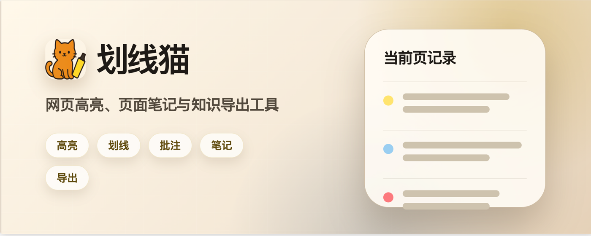
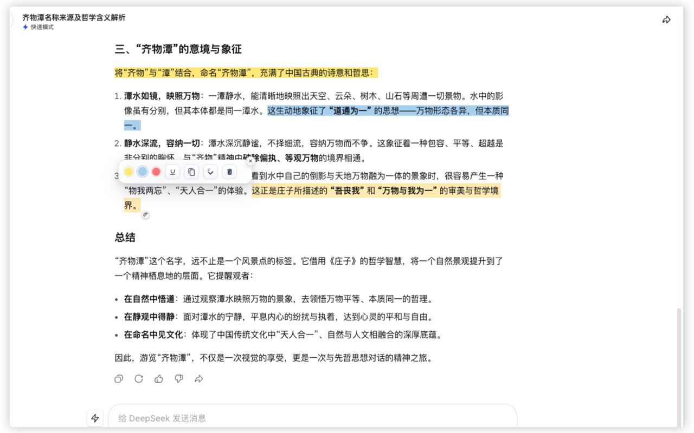
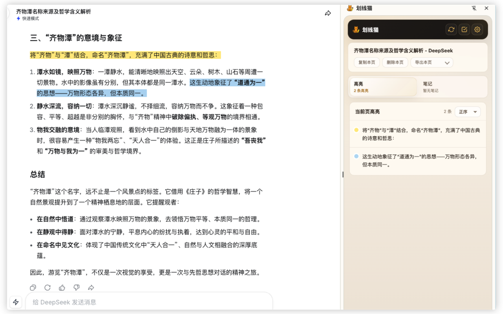
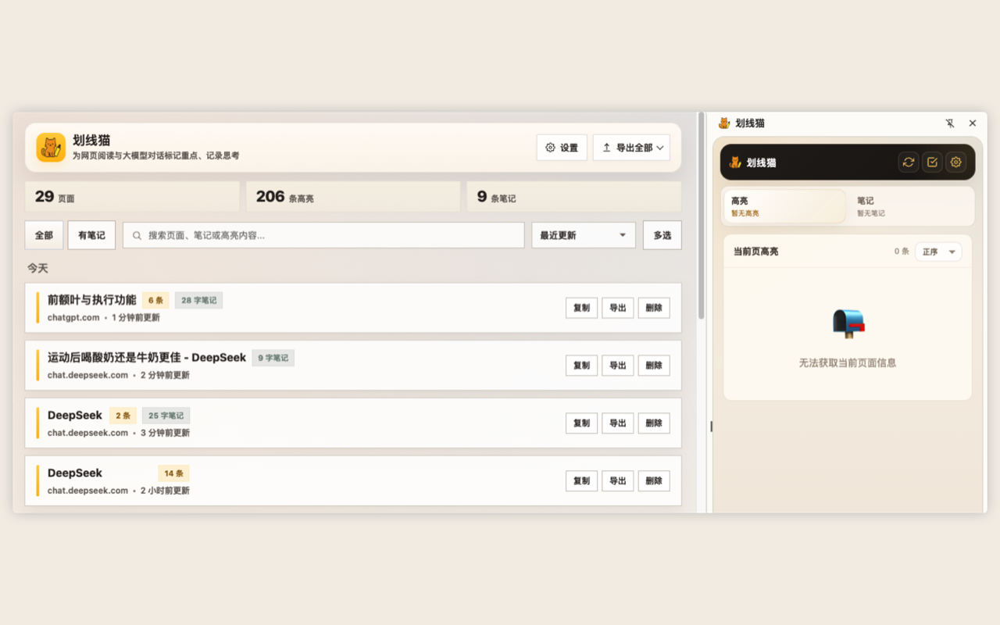

# 划线猫 Cat Highlighter

中文 | [English](README_EN.md)

隐私说明：[PRIVACY.md](PRIVACY.md)

问题反馈：[GitHub Issues](https://github.com/Kakauiber/Cat_Highlighter/issues)

划线猫是一款面向网页阅读、资料研究和大模型对话场景的浏览器标注工具。你可以在网页上高亮、划线、添加批注，随手记录页面笔记，并把内容整理导出到 Markdown、HTML、墨问、Notion、Obsidian 或思源笔记。

插件重点适配 ChatGPT、Gemini、Kimi、DeepSeek、Perplexity / Comet 等大模型对话页面。不同对话页面会按页面地址分别保存，刷新或重新打开页面后仍可恢复高亮记录。

<p align="center">
  
</p>

<p align="center">
  
  
  
</p>

## 核心功能

- 网页文字高亮、划线与颜色标记。
- 为单条高亮添加批注。
- 当前页侧边栏：查看本页高亮、写页面笔记、复制本页、删除本页、导出本页。
- 管理页：统一查看全部页面、筛选有笔记 / 仅笔记 / 仅高亮、批量复制、批量删除、导出全部。
- 页面笔记：为当前网页或大模型对话单独记录想法、疑问和后续追问点。
- 刷新恢复：页面刷新后自动恢复已保存高亮。
- 导出格式：Markdown、HTML、墨问私密笔记、Notion 页面、Obsidian 仓库、思源笔记文档。

发布记录见 [CHANGELOG.md](CHANGELOG.md)。

## 本地安装

以 Chrome / Edge / Arc / Comet 等 Chromium 内核浏览器为例：

1. 打开浏览器扩展管理页。
2. 开启「开发者模式」。
3. 点击「加载已解压的扩展程序」。
4. 选择本项目目录。

项目目录示例：

```text
/Users/summer/Documents/Programs/Antigravity/Cat_highlighter_extension_v1.5.4
```

安装后，点击浏览器工具栏里的「划线猫」图标即可打开侧边栏。

## 基本使用

### 高亮或划线

1. 在网页中拖选一段文字。
2. 在弹出的工具条中选择黄色、蓝色、红色高亮，或点击划线按钮。
3. 标注会自动保存。
4. 刷新页面后，已保存的高亮会自动恢复。

### 查看当前页记录

打开侧边栏后：

- 「高亮」页显示当前页面的全部高亮和划线记录。
- 可以切换「正序 / 倒序」，方便在记录较多时快速查看最新内容。
- 单条记录可复制、添加批注、删除。
- 「复制本页」会复制当前页笔记和当前页高亮的纯文本内容。
- 「删除本页」会删除当前页全部高亮记录。
- 「导出本页」可导出当前页笔记和高亮。

### 页面笔记

侧边栏切换到「笔记」页，即可为当前网页或当前大模型对话写笔记。

页面笔记适合记录：

- 阅读时想到的问题。
- 对高亮内容的总结。
- 后续要继续追问大模型的问题。
- 对网页资料的判断、备注和行动项。

笔记会自动保存，也支持 `Command + S` / `Ctrl + S` 主动保存。

### 管理全部记录

点击侧边栏右上角「管理」按钮，可以进入管理页。

管理页支持：

- 查看全部保存过高亮或笔记的页面。
- 搜索页面标题、链接、笔记和高亮内容。
- 按最近更新排序。
- 筛选全部页面、有笔记、仅笔记、仅高亮。
- 页面级展开查看高亮和笔记。
- 多选记录后批量复制或批量删除。
- 导出全部记录。

## 导出功能

### Markdown

导出为 `.md` 文件，适合保存、继续编辑、喂给 AI 或导入知识库。

导出内容包括：

- 页面标题。
- 原文链接。
- 页面笔记。
- 高亮 / 划线记录。
- 批注。

### HTML

导出为 `.html` 文件，适合保留更清晰的阅读排版。

### 墨问

墨问导出会通过墨问 Open API 创建私密笔记。

配置方式：

1. 在管理页打开「设置」。
2. 在「导出配置」中选择墨问。
3. 填写墨问 API Key。
4. 可选填写默认标签。
5. 先点击「测试」，测试成功后即可正式导出。

### Notion

Notion 导出会通过 Notion 官方 API，在目标父页面下创建新的子页面。

配置方式：

1. 打开 Notion 设置页，点击上方「连接」。
2. 点击「开发或管理集成」，再点击「创建新集成」。
3. 填写「集成名称」，并在「安装范围（Installation scope）」处选择目标父页面。
4. 创建完成后，复制「API 集成密钥（Integration Token）」。
5. 回到划线猫管理页，在 Notion 配置中粘贴 API 集成密钥。
6. 复制目标父页面链接，粘贴到「目标父页面链接 / ID（Page ID）」处。
7. 先点击「测试」，测试成功后即可正式导出。

### Obsidian

Obsidian 导出会先写入剪贴板，再通过 `obsidian://new` 协议创建到指定仓库。

配置方式：

1. 在管理页打开「设置」。
2. 在 Obsidian 配置中填写仓库名称 / 路径。
3. 获取路径时，可以打开 Obsidian 桌面版，找到左下角的仓库切换器并切换至目标仓库，右键点击目标仓库区域，在弹出菜单中点击「复制路径」。
4. 可选填写目标文件夹，例如 `Clippings/划线猫`。
5. 先点击「测试」，确认 Obsidian 中生成测试笔记。

### 思源笔记

思源导出会通过思源本地 API 写入指定笔记本。

配置方式：

1. 打开思源桌面版。
2. 进入「设置」->「关于」。
3. 复制 API Token。
4. 在划线猫管理页填写服务地址和 API Token。
5. 点击「刷新笔记本」，选择目标笔记本。
6. 可选填写目标目录。
7. 先点击「测试」，测试成功后即可正式导出。

## 数据与隐私

划线猫默认把高亮、批注、页面笔记和导出配置保存在浏览器本地 `chrome.storage.local` 中。插件没有自建服务器，也不会主动上传你的网页内容。

只有当你主动点击导出到墨问、Notion 或思源笔记时，相关页面笔记和高亮内容才会发送到对应第三方服务。详细说明见 [PRIVACY.md](PRIVACY.md)。

## 项目结构

- `manifest.json`：扩展配置入口。
- `content.js`：网页选区、工具条、高亮创建与恢复。
- `background.js`：后台服务逻辑。
- `sidepanel.html` / `sidepanel.js` / `sidepanel.css`：侧边栏界面与交互。
- `options.html` / `options.js` / `options.css`：管理页界面与交互。
- `export-service.js`：统一导出数据结构与 Markdown / HTML 渲染。
- `mowen-exporter.js`：墨问 API 导出。
- `notion-exporter.js`：Notion API 导出。
- `obsidian-exporter.js`：Obsidian 协议导出。
- `siyuan-exporter.js`：思源本地 API 导出。
- `note-repo.js` / `page-note-service.js`：页面笔记存储与处理。

## 发布准备

Chrome Web Store 上架前请检查：

- 已完成主要网站回归测试。
- 已更新 `README.md` 和 `PRIVACY.md`。
- 已准备 Chrome 商店描述、截图、权限说明。
- 已确认 `manifest.json` 版本号。
- 已打包干净的扩展 zip。

详细清单见 [docs/release-checklist.md](docs/release-checklist.md)。

## License

MIT License. See [LICENSE](LICENSE).
